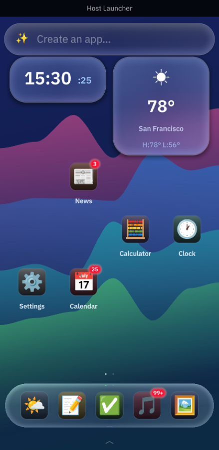

# Host Launcher

A home-screen launcher app, built in pure Rust with [Makepad](https://github.com/makepad/makepad)
and the [Project Robius](https://github.com/project-robius) app-dev framework.

It looks and behaves like an iOS/Android home screen — paged grids of app icons,
swipe navigation, long-press-to-rearrange, an app drawer, and live home-screen
widgets — but every "app" is actually a **Splash mini-app**: a chunk of Makepad's
Splash UI-scripting DSL that runs inside its own isolated Splash VM, hosted by the
single `host_launcher` process.



## What it is

The launcher is one regular Makepad desktop/mobile app that merely *looks* like a
phone launcher. Each icon is a shortcut to a mini-app written entirely in Splash
(no per-app Rust). Tapping an icon zooms it up into a nearly-fullscreen view; a
back/close button (or the Android back gesture) zooms it back into its icon.

Mini-apps are strongly isolated: each runs in its own Splash VM (`ScriptHeap` +
`ScriptStd`), can't reach the host UI or a sibling app's widgets, can't touch the
filesystem or spawn processes, and can't hang the host (a runaway loop is cut off
by a per-entry time budget). See [Isolation](#isolation).

## Features

- **AI "create app" bar**: a Google-style pill on the home screen; type what
  you want and an ACP agent writes a Splash mini-app, the launcher validates
  it against the real parser (repairing until it compiles), and it installs
  like any other. Backed by your Claude subscription, an API key, or a local
  model — see [Running](#running) and [docs/GENERATE.md](docs/GENERATE.md).
- **Modify apps by asking**: long-press any app → **✏️ Modify App…** (the bar
  prefills and focuses), or just type what you want changed — "make the weather
  app show animations" is recognized as an edit of an app you already have.
  Every change is archived: **App Info & History…** (also in the long-press
  menu) shows the app's details, storage, and timestamped version history —
  restore any earlier version.
- **Paged icon grid** with iOS-style horizontal swipe, flick velocity, page
  snapping, and rubber-banding at the ends. A dot indicator tracks the position.
- **App drawer** (Android-style): swipe up (or tap the chevron) for a scrollable
  grid of every installed app, with a sort toggle for **Alphabetical ⇄ Recent**.
- **Long-press editing**: hold an icon to lift it, then drag to rearrange (with
  edge-of-screen page flips and drop-to-swap). Release in place for a context
  menu (Open / Remove from Home / Add Widget / Force Stop / Uninstall / …).
- **Home-screen widgets**: an always-running Splash mini-app pinned to a resizable
  grid-cell span, exactly like Android widgets. The bundled Clock and Weather
  widgets ship on the default home screen.
- **Icon → fullscreen animation** on open, and the inverse on close.
- **Keep-alive**: closing a mini-app keeps its VM running (state survives a
  reopen); "Force Stop" tears the VM down and restarts it fresh next open.
- **Back-button / Escape** navigation that unwinds context menu → mini-app →
  drawer → edit mode → non-first page, matching platform expectations.
- **Liquid-glass theme**: a live animated vector backdrop with translucent glass
  surfaces that refract it, following the `makepad-example-aichat` look.
- **Safe-area insets**: content pads itself out of the device's unsafe areas
  while the backdrop bleeds under the system bars.
- **Reflows** from a phone-shaped window to any desktop window size.
- **Persistence**: home layout, recents, and user-installed apps are saved as
  JSON under the platform data dir (via `robius-directories`).

## Pre-installed mini-apps

All written in pure Splash (`apps/*.splash`). The built-ins can't be uninstalled;
two samples (Counter, Stopwatch) are "user-installed" so uninstall is testable.

| App | What it demonstrates |
|-----|----------------------|
| Weather | Tap-a-day forecast with hourly bar chart; also provides a home widget |
| Clock | Live ticking time + world clocks; also a home widget (uses the timer + wall-clock APIs) |
| News | Headline list with tap-to-read detail |
| To-Do | Add / toggle / clear tasks (struct-array state, dynamic list rendering) |
| Notes | Write and save notes |
| Calculator | Numeric glass calculator |
| Settings | Quick-settings mockup with glass toggles |
| Calendar | Month grid with prev/next navigation and day selection (date math) |
| Music | Mock player with a working queue and play/pause state |
| Gallery | Photo grid with a lightbox detail view |
| Counter | Minimal counter (deletable sample) |
| Stopwatch | Lap timer (deletable sample; uses interval timers) |

Editing an `apps/*.splash` file and reopening the app picks up the change without
a rebuild (the sources are read from disk in a dev checkout, and baked into the
binary for release).

## Running

```sh
cargo run                 # desktop (opens a phone-proportioned, resizable window)
cargo run --release       # optimized
```

Poke around: swipe between pages, swipe up for the drawer, long-press an icon
to rearrange or get its menu, drag things in and out of the dock.

**Make an app with AI.** Tap the ✨ pill at the top, type what you want ("a
pomodoro timer", "a dice roller"), hit return — an agent writes it, the
launcher checks it compiles (repairing if not), and it installs. To change an
app later, long-press it → **✏️ Modify App…** and type the change (or just ask
the bar: "make the weather app show animations"); every edit is revertible from
**App Info & History…**. You need an LLM behind it; the quickest is your Claude
subscription:

```sh
./scripts/run_with_claude.sh    # installs the adapter, runs on your `claude` login
```

...or paste an API key into the ✨ modal, or point it at a local Ollama, or
any ACP agent. Full rundown of every option in
[docs/GENERATE.md](docs/GENERATE.md).

**Where your stuff lives.** Everything is under the platform data dir
(`~/Library/Application Support/rs.robius.host_launcher/` on macOS):
`layout.json` (your home screen), `apps/<id>/app.splash` (each installed
app's code, editable), and `app_data/<id>/` (each app's private saved data —
apps can persist to a sandboxed filesystem; see below), and
`apps/<id>/versions/` (timestamped snapshots of every AI edit). Built-in apps live in
`apps/*.splash` in the repo.

### Dependencies

Uses a sibling `../makepad` checkout as a path dependency. This branch needs
the `splash_improvements` branch specifically (it carries the Splash storage
jail + a few other patches); it currently points at a `../makepad-si` worktree
where that branch is checked out. See `Cargo.toml`.

## Testing

Headless UI tests drive a real build of the app through Makepad's `makepad_test`
harness (synthesized clicks/drags/keys + widget-state assertions), rendered
offscreen via the software rasterizer:

```sh
HOST_LAUNCHER_FRESH=1 OCTOS_CONFIG_DIR=$(mktemp -d) \
  HOST_LAUNCHER_AGENT_CMD=$PWD/target/debug/fake_acp \
  cargo test --test ui -- --test-threads=1
```

`HOST_LAUNCHER_FRESH=1` starts each app from the default layout and redirects all
persistence to a throwaway temp dir, so tests are order-independent and never
touch your real launcher state (the headless harness sets `MAKEPAD=headless`,
which also forces this — so a forgotten env var can't clobber your profile).
`HOST_LAUNCHER_AGENT_CMD=…/fake_acp` points the create-bar tests at a
deterministic offline agent (no LLM needed); `OCTOS_CONFIG_DIR` sandboxes the
provider-setup test's config write. Failure artifacts land in
`target/makepad_test/host_launcher/<test>/`.

`cargo test --lib` runs the fast unit tests (pipeline, persistence, the storage
jail) with no harness.

For visual verification of the live GPU-rendered glass, the app supports two
env-gated debug hooks (see `src/app.rs`): `HOST_LAUNCHER_AUTOMATION_DIR=<dir>`
enables a file-triggered `capture_next_frame_to_file` screenshot + widget-tree
dump, and `HOST_LAUNCHER_DEBUG_STATE=open:<app>|drawer|edit|setup|genbusy` jumps
straight to a UI state on startup.

## Architecture

```
src/
  app.rs                     top-level App: state, action routing, back-nav
  persistence.rs             modular save/load: layout.json + apps/<id>/ + app_data/<id>/
  shared/styles.rs           glass backdrop + icon-tile styles
  launcher/
    home_screen.rs           home composition (create bar + pager + dock + drawer)
    home_pager.rs            paged grid: swipe, long-press, drag-reorder, widget tiles
    create_bar.rs            the ✨ AI create-app bar + activity panel
    app_drawer.rs            swipe-up drawer with sort toggle
    context_menu.rs          long-press context menu (Open / Refine / Uninstall / …)
    dock.rs                  the editable favorites dock
  generate/                  the AI app generator (see docs/GENERATE.md)
    acp_client.rs            minimal ACP-over-stdio agent client
    pipeline.rs              prompt → extract → validate → repair → install
    octos_inproc.rs          in-process octos backend (feature agent-octos)
    splash_guide.md          the Splash dialect taught to the agent
  mini_apps/
    registry.rs              app manifests + persistable layout model
    builtin.rs               the pre-installed app manifests
    mini_app_screen.rs       fullscreen Splash host + open/close animation + keep-alive
  bin/fake_acp.rs            deterministic offline agent for tests
apps/*.splash                the pure-Splash mini-app sources
docs/GENERATE.md             the AI create-app bar: providers, backends, testing
docs/DESIGN_DECISIONS.md     design questions and the answers chosen
```

The launcher follows Robrix's conventions: `script_mod!` UI, one widget family per
file, `AppState` shared to widgets via `Scope`, `robius-directories` for paths,
and `SAFE_INSET_PAD_*` applied by whichever widget draws into an edge.

## Isolation

Each mini-app is hosted by a `Splash` widget, which allocates a dedicated Splash
VM. To make these safe to host mutually-untrusting apps, the `makepad` fork's
`splash_improvements` branch extends the Splash isolate:

- **Ambient authority removed**: `mod.run` (process spawn) and `mod.res`
  (resource loader — it reached both disk and net) are stripped from every
  isolate, and raw `net.socket_stream` is gated behind the same net-runtime
  check as HTTP — so a mini-app with `allow_net: false` has no I/O escape.
- **Sandboxed storage**: `mod.fs` is re-registered as a *jailed* filesystem —
  the app sees a root at `/` that is really its own `app_data/<id>/` directory
  and nothing else (lexical path containment, symlink defense, quotas, a root
  the script can't read or retarget). So apps CAN save data
  (`fs.write("/x.json", v.to_json())`, `fs.read`, `fs.list`, …) but can't touch
  anything outside their private dir — like a phone app's internal storage.
- **UI reach confined**: an isolate's `ui` handle (and `ui.root`) only resolves
  widgets within that mini-app's own subtree, so it can't find or drive host or
  sibling-app widgets by name.
- **Isolate-safe timers**: `std.start_timeout` / `start_interval` callbacks are
  dispatched back into the owning isolate VM (they previously ran against the main
  VM's heap), and stale timers are torn down when an isolate is reclaimed.
- **Wall-clock API**: `std.time_now()` and `std.local_time()` were added so pure
  Splash apps (the Clock, Calendar) can read the time; the host supplies the local
  UTC offset.

Runaway scripts are already contained by Makepad's per-entry 64 ms time budget and
200k-instruction limit, so an infinite loop in an `on_click` cannot hang the
launcher or starve other apps.
