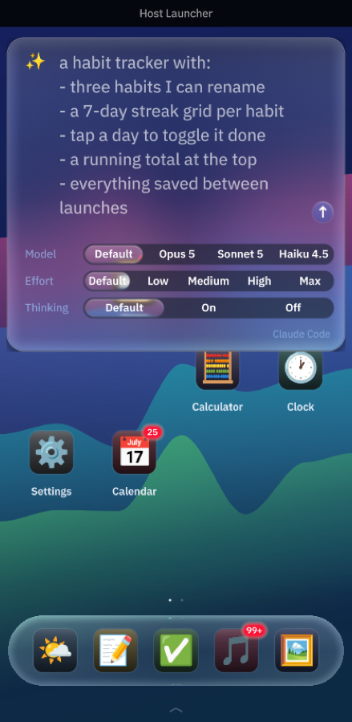
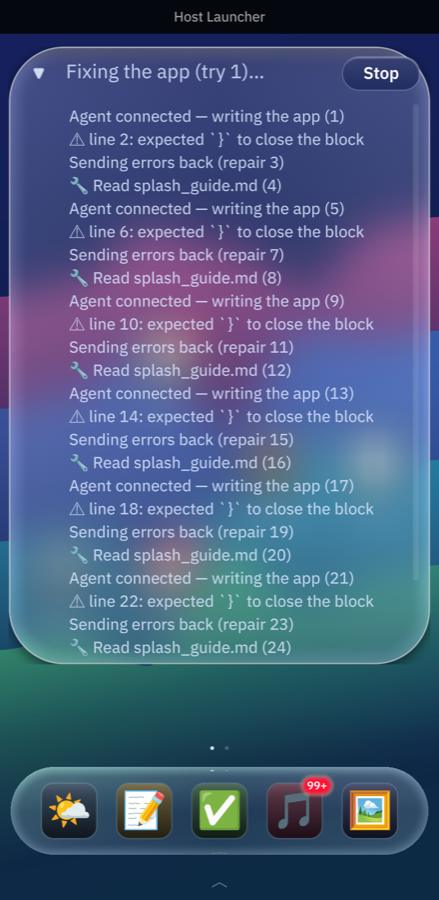

# The AI "create app" bar

The glass pill at the top of the home screen generates new mini-apps from a
one-line request: type "a pomodoro timer" and hit return, and a few seconds
later the finished app's icon lands on your home screen like any other install.

## How it works

```
create bar ──▶ spawn ACP agent (`octos acp`) ──▶ session/prompt
                                                      │  (dialect guide + request)
   streamed status ◀── session/update chunks ◀────────┘
                                                      ▼
                       extract the ```splash fence ──▶ validate with the REAL
                                                       Splash parser (throwaway
                                                       isolate, captured errors)
                                                      │
                             ok ◀─────────────────────┤ errors
                              │                       ▼
                              │            repair turn (errors fed back,
                              │            same session, max 2 attempts)
                              ▼
                    MiniAppManifest { builtin: false, allow_net: false }
                    → user_apps + registry + home-screen icon (persisted)
```

- **Transport**: the [Agent Client Protocol](https://agentclientprotocol.com)
  over stdio — newline-delimited JSON-RPC 2.0. host_launcher implements a
  minimal std-only client (`src/generate/acp_client.rs`, no async runtime);
  events reach the UI thread via a queue + `SignalToUI`, mirroring the pattern
  octos-one uses.
- **One process per generation**: the agent is spawned on submit and killed on
  completion/cancel. No reconnect state; Stop just kills it.
- **The agent is swappable**: anything that speaks ACP works. octos is the
  default; Claude Code or Gemini ACP adapters should work unmodified.
- **Prompting**: `src/generate/splash_guide.md` teaches THIS repo's Splash
  dialect (exemplar-driven, with hard prohibitions on other dialects' idioms
  like octos-one's `sys.*` helpers). The reply contract is one ```` ```splash ````
  fence starting with `// name:` / `// icon:` / `// tint:` header comments.
- **Validation is the real parser**, not a lint: makepad's
  `validate_splash_body` (widgets/src/splash.rs) dry-runs the source in a
  throwaway isolate with the exact prefix/instruction-limit the Splash widget
  uses and returns the captured errors, which are fed back verbatim in repair
  turns.

## Setup (once)

1. Build/install the octos CLI (the default `octos acp` needs no extra cargo
   features):

   ```bash
   git clone https://github.com/octos-org/octos && cd octos
   cargo install --path crates/octos-cli
   ```

2. Give it an LLM provider — pick whichever is least effort for you:

   - **Paste a key in the app**: tap the bar's ✨ (the modal also opens
     automatically when generation fails for lack of setup), paste an API
     key, Save. The provider is inferred from the key's prefix (`sk-ant-` →
     anthropic, `sk-or-` → openrouter, `gsk_` → groq, `AIza` → gemini,
     `sk-` → openai) and a minimal octos config is written to `~/.octos/`
     (0600; a config the launcher didn't write is never overwritten).
   - **Already exported in your shell?** Nothing to do — the launcher infers
     the provider from whichever of `ANTHROPIC_API_KEY`, `OPENAI_API_KEY`,
     `GEMINI_API_KEY`, `OPENROUTER_API_KEY`, `DEEPSEEK_API_KEY`,
     `GROQ_API_KEY`, `MOONSHOT_API_KEY` is set (that order) and passes
     `--provider`; the key is read from the environment by octos itself.
   - **`octos auth login -p anthropic`** stores a pasted key in octos's auth
     store/keychain — the launcher detects that too.
   - **`octos init`** for everything else: models, custom endpoints,
     fallbacks. An existing config always wins over auto-detection.

   **Claude Pro/Max subscription (no API key)**: your subscription can't
   back *octos* (it has no Anthropic OAuth, and subscription tokens are
   Claude-Code-only) — but Claude Code itself speaks ACP, and the bar is a
   generic ACP client:

   ```bash
   ./scripts/run_with_claude.sh      # installs the adapter if needed, then runs
   ```

   or by hand:

   ```bash
   npm install -g @zed-industries/claude-code-acp
   HOST_LAUNCHER_AGENT_CMD="claude-code-acp" cargo run
   ```

   That generates on your existing `claude` login (run `claude` → `/login`
   once if you never have), billed to the subscription like any Claude Code
   session. Put the export in your shell profile to make it the default.
   Don't export `ANTHROPIC_API_KEY` alongside it, or Claude Code may bill
   the API instead (the script unsets it for the run). For an octos backend
   specifically you'd need an API key from console.anthropic.com (billed
   separately).

   **No API key at all?** Three options:

   - **Fully local (private, free)**: install [Ollama](https://ollama.com)
     and pull a code model — `ollama pull qwen2.5-coder:14b`. A running
     Ollama on the default port is auto-detected as the last-resort
     provider (no key, no account); the launcher picks the best pulled
     model, preferring code-tuned ones. Expect lower dialect accuracy than
     the frontier models — the repair loop earns its keep here.
   - **ChatGPT account**: `octos auth login -p openai` runs octos's OAuth
     flow (browser or `--device-code`) — no API key; the launcher detects
     the stored login automatically.
   - **Free-tier keys**: Gemini and Groq offer no-payment API keys, and
     OpenRouter has `:free` models — those go through the normal paste-a-key
     modal.

3. Optional overrides via the agent command line:

   ```bash
   # a different provider/model, or a different ACP agent entirely
   export HOST_LAUNCHER_AGENT_CMD="octos acp --provider anthropic --model claude-sonnet-4-5"
   ```

   The default is plain `octos acp`. The agent's tools are rooted at
   `~/.host_launcher/agent_workspace/` (created on demand).

   Note the agent is a normal child process: it inherits the launcher's
   environment (that's how provider API keys reach it) and runs with your
   user's privileges. Only point `HOST_LAUNCHER_AGENT_CMD` at agents you
   trust. The *generated apps*, by contrast, run in a stripped Splash isolate:
   no filesystem, no subprocesses, no resource loader, no network.

## Modifying an app

Two ways in, both landing in the same place:

- **From the app**: long-press (or right-click) any app → **✏️ Modify App…**.
  The create bar prefills with `✏️ Weather: ` and takes focus, so you just
  type the change and hit return.
- **Just ask**: type it into the bar and the launcher works out that you mean
  an app you already have — "make the weather app show animations", "add a
  reset button to the pomodoro". Naming an installed app *and* phrasing it
  like an edit is what triggers it; anything that sounds like a new app
  ("create a weather app") still creates one. See `src/generate/intent.rs`.

Either way the prompt carries the app's current source and the result replaces
it **in place**: same id, same home placements, name/icon/tint may update, the
app restarts on next open, and the previous version is archived first.

Built-ins can be modified too — the result is saved as a user override that
shadows the stock app. It stays non-uninstallable; version history is how you
get the original back.

## App Info & version history

Long-press an app → **App Info & History…** opens its settings page: what kind
of app it is, where it's placed, whether it may use the network, how much it
has stored (with **Clear**), its code size, and the destructive actions
(Force Stop, Uninstall). The long-press menu itself stays short — it only
carries what you do *to the home screen*.

Version history lives on that page. Every modification (and every restore)
archives what it replaced, so edits are undoable: snapshots are listed
newest-first with the date and the request that superseded each one, and
**Restore** puts one back (snapshotting the current state first, so the restore
is itself undoable).

On disk they're plain files beside the app, timestamped in local time:

```
apps/<id>/versions/20260727-105412.splash    the source as it was
apps/<id>/versions/20260727-105412.json      when, why, and its name/icon/tint
```

The newest 20 are kept per app; older ones are pruned.

## Cargo features (all off by default)

| Feature | Effect |
|---|---|
| `agent-octos` | Link the octos agent core **in-process** (no child process — required for iOS, where `exec()` is prohibited). Reads the same `~/.octos/config.json`; providers resolve through octos-llm's registry with retry. `HOST_LAUNCHER_AGENT_CMD` still wins when set, so the offline test agent keeps working. Not replicated from full octos (use the external agent for these): fallback-model routing, OAuth auth-store keys, `keychain:` markers, MCP/plugins. Costs ~300 extra crates and a fatter binary. |
| `agent-skills` | Deploy the dialect guide **persistently on the agent side** — for `octos acp`, as the `<workspace>/.octos/AGENTS.md` bootstrap file (appended to the system prompt on every `session/new`, uncapped); for the in-process backend, appended directly. Per-turn prompts shrink from ~6KB to one pointer line. Foreign ACP agents that ignore the file still work — the prompt falls back to inlining. |
| `agent-tools` | Allow the agent to research with its tools (web search/fetch) before answering, baking found data into the app as constants — "an app with the current F1 calendar" actually looks it up. Tool activity streams as bar status. The generated app itself still runs sandboxed and offline. |

## Remote agents (no feature needed)

The transport is stdio, and stdio composes: point the bar at an agent running
anywhere —

```bash
export HOST_LAUNCHER_AGENT_CMD="ssh myserver octos acp"
```

That's the whole thin-client story for a machine that can't (or shouldn't)
run the model locally: the launcher stays unchanged, ssh carries the NDJSON.

## Testing offline

`src/bin/fake_acp.rs` is a deterministic stand-in agent: it speaks just enough
ACP and picks its scenario from the prompt text (a valid app by default, an
invalid-then-repaired one for requests containing "broken", a refusal for
"refuse"). The UI tests run against it:

```bash
HOST_LAUNCHER_FRESH=1 OCTOS_CONFIG_DIR=$(mktemp -d) \
    HOST_LAUNCHER_AGENT_CMD=$PWD/target/debug/fake_acp \
    cargo test --test ui -- --test-threads=1
```

(`OCTOS_CONFIG_DIR` sandboxes the setup-modal test's config write; that test
fails fast rather than ever touching a real `~/.octos`.)

## The bar: composer, then console

The bar is one glass pill that floats *over* the home screen — it grows down
across your icons and widgets rather than reflowing them (a fixed-height slot
below it reserves the resting position so the grid still starts underneath).

Idle, it's a multi-line composer: the prompt grows with what you type, up to
75% of the screen, and scrolls past that. Return submits **only when a
physical keyboard is attached** — on a phone, Return has to be able to type a
newline — so a Send arrow appears beside the field as soon as it's non-empty
(beside, not under: its own row doubled the bar's height the moment you typed
a character). That's
also how the UI tests submit (`submit_prompt()` in `tests/ui.rs`); a headless
harness reports no physical keyboard.

Once you submit, the same space becomes the agent's console: a status line
with Stop, over the run's log — connection and phase changes, tool calls,
validation errors being sent back for repair — and a live tail of the code as
it streams in.

The console keeps the **whole** run and scrolls (wheel or drag), and it only
ever grows: it sizes to the log, stops just above the dock, and never comes
back down — a box that shrinks under the text you're reading is worse than one
that's briefly too big. It follows the tail like a terminal until you scroll
or press inside it, then leaves you where you are.

When the run finishes the output **stays**, with the result appended as its
last line. Press anywhere outside the bar to dismiss it and get the composer
back. (It used to erase itself a few seconds after finishing, which took the
explanation with it.) While the agent works
the ✨ gives up its slot to a triangle that hides the output — it rotates
between pointing right (hidden) and down (showing), and brings the console
back at the size it had; the sticky choice lasts the session. Presses on the bar
never fall through to the icons underneath, and it reverts to the composer
when you dismiss it.

### Agent options

Focus the prompt (or start typing) and a row of controls appears under it:
**Model**, **Effort**, **Thinking**. They're glass segmented controls, and your
picks persist across launches.

Which controls appear depends on the **active backend**, because there's no
cross-provider standard for any of this:

| Backend | Model | Effort | Thinking | How it's delivered |
|---|:---:|:---:|:---:|---|
| Claude Code (`claude-code-acp`) | ✅ | ✅ | ✅ | `ANTHROPIC_MODEL`, `CLAUDE_CODE_EFFORT_LEVEL`, `MAX_THINKING_TOKENS` — env vars the CLI reads itself |
| octos (anthropic) | ✅ | ✅ | — | model via `octos acp --model …`; effort via `gateway.reasoning_effort` |
| octos (openai, gemini, groq, …) | — | ✅ | — | effort via `gateway.reasoning_effort` |
| any other ACP agent | — | — | — | unknown binary, unknown knobs |

Every control maps to a setting the agent itself has. There's deliberately no
invented "thorough mode" knob: a control that only appends encouragement to the
prompt looks like a capability and isn't one.

A knob nobody reads is worse than a missing one — it looks like it works — so
the bar only shows what the live backend can actually honour, and names that
backend under the controls.

Two wrinkles worth knowing:

- **Effort on octos edits octos's config.** `octos acp` has no `--effort` flag
  (that's `octos chat`); it reads `gateway.reasoning_effort` from
  `config.json`, and octos itself treats that as a persistent setting applied
  to every turn. So the control writes that one field — everything else in the
  file is preserved — and octos maps it per provider: `reasoning_effort` for
  OpenAI and Grok, a thinking budget for Gemini, a thinking block for
  Anthropic. Models with no reasoning style ignore it.
- **The effort ladder is probed, not assumed.** `xhigh` exists in the API and
  in current Claude Code, but *not* in the runtime `claude-code-acp@0.16.2`
  bundles (`@anthropic-ai/claude-agent-sdk@0.2.44`, whose ladder is
  `low`/`medium`/`high`/`max`). An unknown level there is **silently dropped**,
  falling back to `high` — so the bar reads the runtime and only offers
  `X-High` when it will actually be honoured. Point `CLAUDE_CODE_EXECUTABLE`
  at a newer `claude` and the level appears by itself.

  That version pin is also why there's no Workflow tool: the adapter is already
  at its latest (0.16.2) but pins an old SDK, so upgrading the adapter doesn't
  help — `CLAUDE_CODE_EXECUTABLE` is the escape hatch until it bumps.

There's no model picker for non-Anthropic providers because we'd have to
invent model ids we can't verify, and a wrong one just errors at generation
time; Ollama already auto-picks the best model you have installed.

Exporting `ANTHROPIC_MODEL` / `CLAUDE_CODE_EFFORT_LEVEL` / `MAX_THINKING_TOKENS`
before launch still works — those seed the controls on a first run, and
whatever you pick in the bar afterwards wins and is remembered
(`agent_prefs.json`).




`HOST_LAUNCHER_DEBUG_STATE=longprompt` boots straight into a tall multi-line
prompt; `=genbusy` into the console; `=genlog` into a console filled past its
cap (for checking the scroll and the ceiling).
